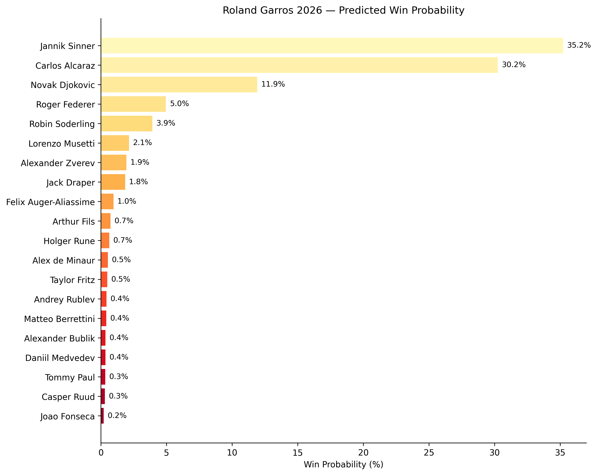
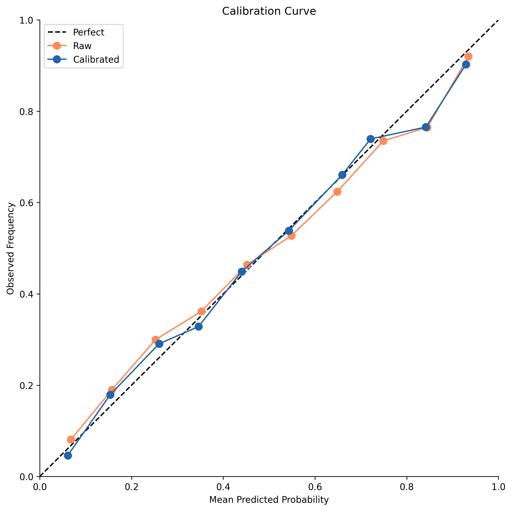
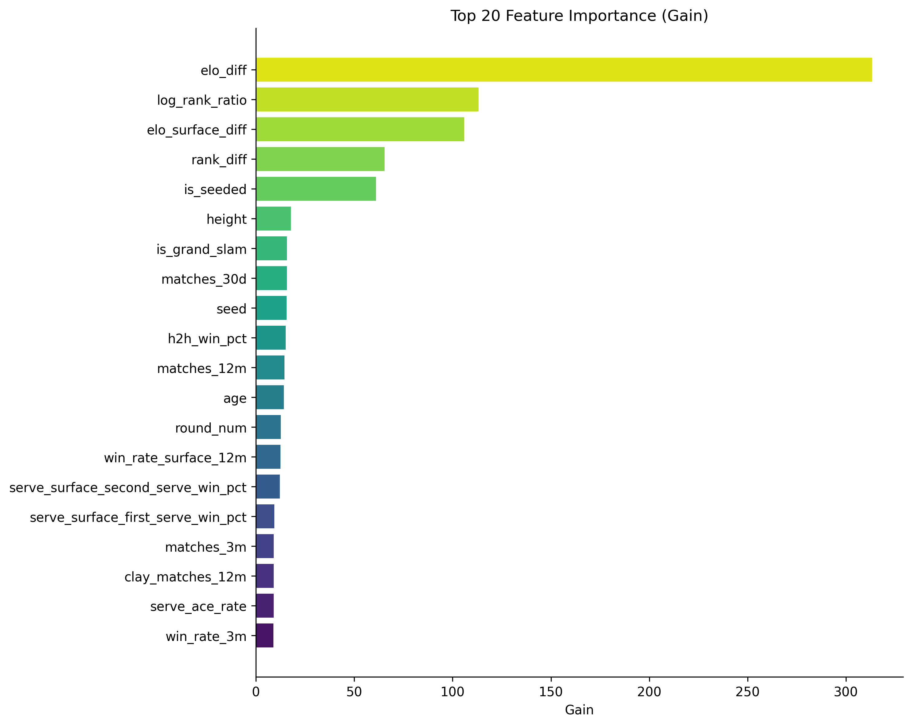
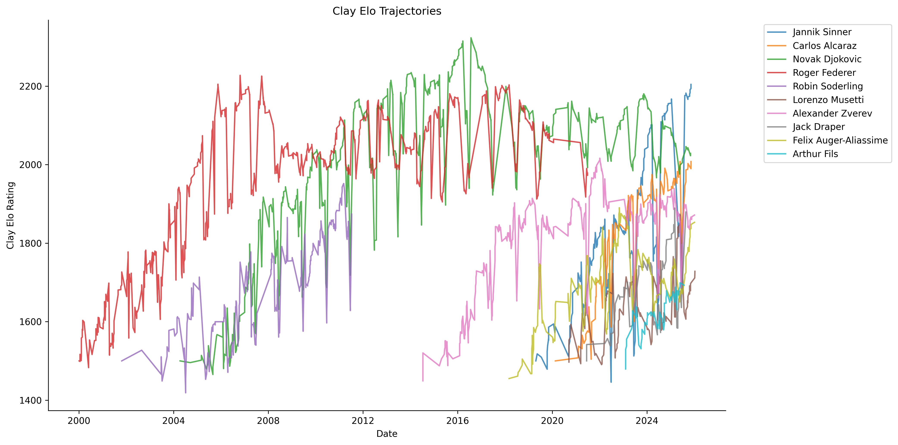

# RG2026-Predict

ML pipeline to predict the Roland Garros 2026 Men's Singles winner. XGBoost match classifier trained on 25 years of ATP data, combined with Monte Carlo bracket simulation over 10,000 tournament draws.

## Results

**Top 5 Predicted Winners** (pre-draw, projected seedings):

1. **Jannik Sinner** — Win: 35.2% · Final: 53.0% · Semi: 62.9%
1. **Carlos Alcaraz** — Win: 30.3% · Final: 49.7% · Semi: 60.3%
1. **Novak Djokovic** — Win: 11.9% · Final: 18.9% · Semi: 24.3%
1. **Lorenzo Musetti** — Win: 2.1% · Final: 8.1% · Semi: 13.5%
1. **Alexander Zverev** — Win: 2.0% · Final: 4.1% · Semi: 13.1%

*Predictions will be updated with the actual draw in late May 2026.*



**Model Performance** (2025 test set):

- **Accuracy (all surfaces)**: 65.2%
- **Accuracy (clay only)**: 64.2%
- **AUC-ROC**: 0.714
- **Log-loss**: 0.618
- **ECE (calibrated)**: 0.016

Baselines: rank-based 64.7%, Elo logistic 63.5%, full logistic 65.0%.



## How It Works

```text
ATP match data (2000-2026)
        │
        ▼
┌─────────────────┐
│  Data Pipeline   │  Fetch Sackmann (2000-24) + TML (2025-26)
│  fetch + clean   │  Reconcile player IDs across sources
└────────┬────────┘
         │
         ▼
┌─────────────────┐
│   Elo Engine     │  Overall + surface-specific ratings
│   75K matches    │  K=32 (new) → K=24 (established)
└────────┬────────┘
         │
         ▼
┌─────────────────┐
│   Features       │  37 features per player-match pair
│   150K rows      │  Rolling form, H2H, serving, Elo, context
└────────┬────────┘
         │
         ▼
┌─────────────────┐
│   XGBoost        │  Optuna HPO (100 trials, expanding-window CV)
│   + Calibration  │  Isotonic calibration on validation set
└────────┬────────┘
         │
         ▼
┌─────────────────┐
│   Monte Carlo    │  128-player bracket, 10K simulations
│   Simulation     │  Precomputed pairwise probability matrix
└─────────────────┘
```

### Features (37 total)

- **Elo ratings**: overall + surface-specific deltas
- **Rankings**: rank difference, log rank ratio
- **Rolling form**: win rates at 12m/3m windows, all surfaces + clay-specific
- **Activity**: match counts (12m, 3m, 30d), clay matches, titles
- **Serving**: 1st serve %, 1st/2nd serve win %, break points saved, ace/DF rates (overall + surface)
- **Head-to-head**: H2H win % with Laplace smoothing `(wins+1)/(total+2)`
- **Tournament context**: round number, seed, Grand Slam flag, RG career history

All features use strict temporal ordering — only data before the match date is visible. Rolling windows enforce `min_periods` to return NaN rather than compute on sparse data.



### Symmetry Enforcement

Every match produces two training rows with opposite labels and negated relative features. This ensures the model treats `P(A beats B)` and `P(B beats A)` consistently without positional bias.

## Quick Start

```bash
make setup      # Install dependencies
make run        # Full pipeline: data → elo → features → train → predict → viz
```

Individual steps:

```bash
make data       # Fetch and clean ATP match data
make elo        # Compute Elo rating histories
make features   # Engineer 37 match-level features
make train      # Baselines + XGBoost HPO + calibration
make predict    # Monte Carlo tournament simulation
make backtest   # Backtest against RG 2015-2025
make viz        # Generate all plots
make test       # Run test suite (58 tests)
```

## Project Structure

```text
rg2026-predict/
├── src/
│   ├── data/          # fetch.py, clean.py, features.py
│   ├── elo/           # engine.py — Elo rating system
│   ├── model/         # baseline.py, train.py, evaluate.py
│   ├── simulate/      # bracket.py, montecarlo.py
│   └── viz/           # bracket_viz.py, feature_importance.py
├── tests/             # 58 unit tests
├── data/
│   ├── raw/           # Source CSVs (gitignored)
│   ├── processed/     # Cleaned parquet files
│   └── elo/           # Elo rating histories
├── models/            # Trained model artifacts (.joblib)
├── outputs/           # Predictions, plots (PNG + HTML)
└── docs/              # PRD
```

## Outputs

All saved to `outputs/` as PNG (300 DPI) + interactive HTML:

- `rg2026_predictions.csv` — Full prediction table
- `win_probability_bar` — Top 20 win probabilities
- `round_heatmap` — SF/Final/Winner advancement heatmap
- `top_contenders` — Grouped bar chart comparing stages
- `feature_importance` — XGBoost gain-based importance
- `calibration_curve` — Raw vs calibrated reliability diagram
- `elo_trajectories_clay` — Clay Elo over time for top players



## Tech Stack

Python 3.12 · pandas · XGBoost · Optuna · scikit-learn · matplotlib · seaborn · plotly

## Data Sources

- [JeffSackmann/tennis_atp](https://github.com/JeffSackmann/tennis_atp) — Historical ATP data, 2000-2024 (CC BY-NC-SA 4.0)
- [Tennismylife/TML-Database](https://github.com/Tennismylife/TML-Database) — Live ATP data, 2025-2026

Both sources are CC BY-NC-SA 4.0. This project is non-commercial and educational only.

## License

This project is for educational and portfolio purposes only. Not for commercial use. Data attribution per CC BY-NC-SA 4.0 requirements above.
